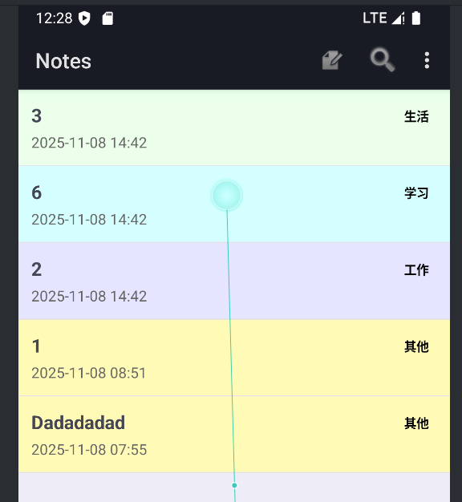
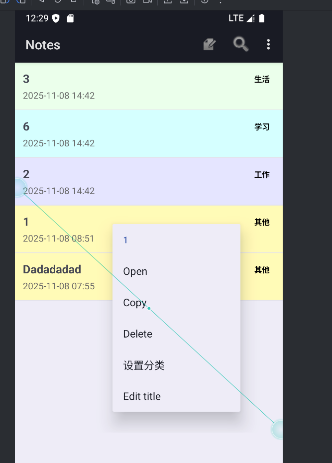
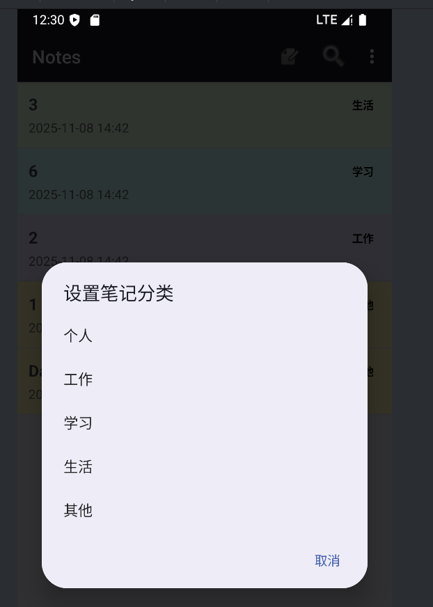
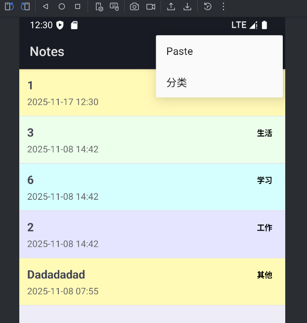
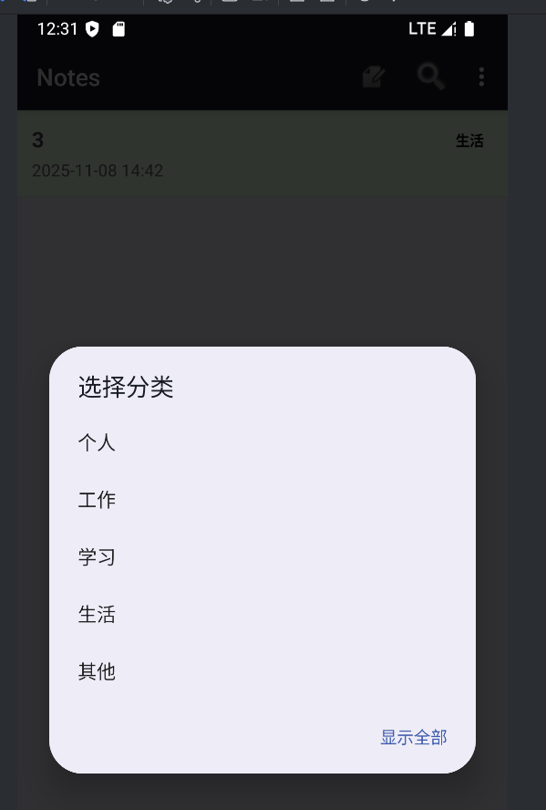
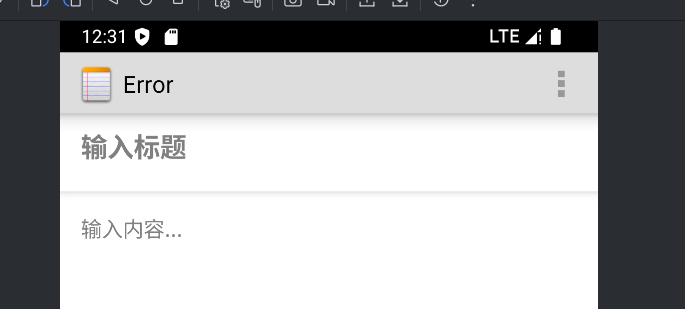
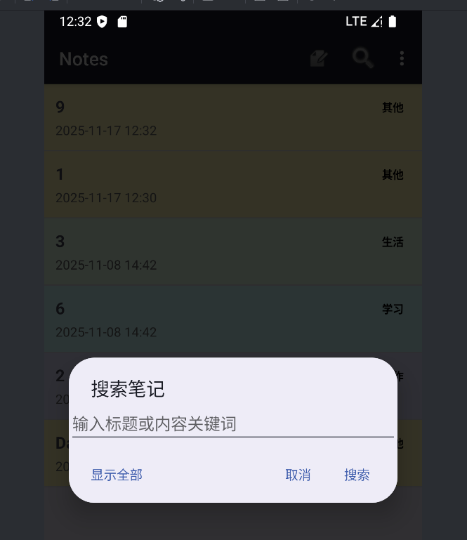

# NotePad 笔记应用 - 期中实验项目
项目介绍
本项目是基于 Android 平台开发的笔记应用，在老师提供的基础新建、保存笔记功能上，新增了时间戳记录、笔记查询、界面美化和分类管理功能，打造了一个功能更完善、交互更友好的个人笔记管理工具。
新增功能说明
1. 时间戳记录
为每条笔记自动添加创建 / 修改时间戳，格式为 年-月-日 时:分，在笔记列表和详情页中展示，方便用户追溯笔记时间线。
2. 笔记查询功能
应用顶部提供搜索按钮，点击后可输入关键词快速筛选笔记，支持标题和内容的模糊查询，高效定位目标笔记。
3. 界面美化
笔记列表采用彩色分类背景（如 “生活” 为浅绿色、“学习” 为浅蓝色等），视觉区分更清晰；
优化字体、间距和图标样式，提升界面现代感与易用性。
4. 分类管理功能
支持 “生活”“学习”“工作”“其他” “个人”五类标签，用户可在首页面时对你想更改的笔记长按更改分类，在首页面左上角选择分类可以只查看该分类的笔记（PS：在新建笔记后是默认为“”其他）
## 截图

